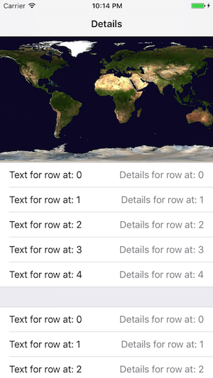
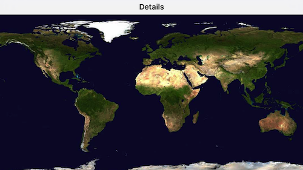

# Auto Sizing SectionView Image
This project demonstrates how to have an image on top of a UITableView that takes 1/3 of the screen in portrait mode and full screen in landscape mode.

###Portrait
  

###Landscape
 

[Read the blog post here](http://villyg.com/2017/02/27/Adding-image-on-top-of-UITableView/)
